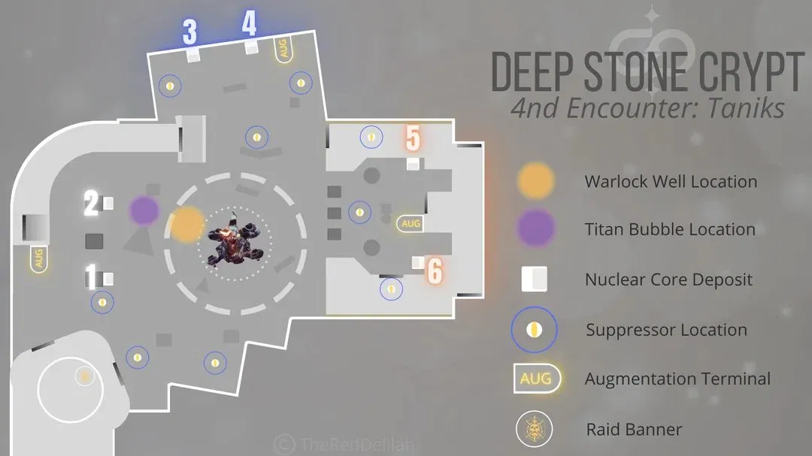

# Deep Stone Crypt — Raid Guide

---

## Quick Reference

| # | Encounter | Type |
|---|-----------|------|
| 1 | [Sparrow / Pike Section](#1-sparrow--pike-section) | Travel |
| 2 | [Crypt Security](#2-crypt-security) | Augment puzzle |
| 3 | [Atraks-1, Fallen Exo](#3-atraks-1-fallen-exo) | Boss fight |
| 4 | [Descent](#4-descent) | Jumping puzzle |
| 5 | [Taniks, Reborn](#5-taniks-reborn) | Nuclear Cores |
| 6 | [Taniks, the Abomination](#6-taniks-the-abomination) | Final boss |

---

## Recommended Loadout

| Weapon | Why |
|--------|-----|
| **The Lament** (Exotic Sword) | Best damage on Atraks-1 replicants — fast burst window |
| **Xenophage** (Exotic MG) | Strong DPS on Crypt Security fuses and Taniks |
| **Divinity** (Exotic Trace Rifle) | Crit bubble on Taniks for the whole team |
| **Linear Fusion Rifle** | Primary DPS for Taniks damage phases |
| **Slug Shotgun** | Close-range DPS on Taniks; pairs well with Divinity |
| **Well of Radiance** (Warlock) | Place inside the damage ring on Taniks |
| **Ward of Dawn** (Titan) | Weapons of Light buff before jumping into the ring |

> ⚠️ Bring **Overload** and **Anti-Barrier** mods — Overload Captains and Barrier Servitors spawn throughout.

---

## Augment System

Three buffs are used across every encounter in this raid. Understanding them before you start saves a lot of confusion.

| Augment | Colour | What It Does |
|---------|--------|-------------|
| **Scanner** | Yellow | Highlights the correct target or glowing object only the holder can see; must call out to teammates |
| **Operator** | Red | Shoots keypads, panels, and purple detention bubbles; opens airlocks |
| **Suppressor** | Blue | Stuns Taniks by standing under drones and shooting him |

Augments are passed between players using **Augmentation Terminals** around each arena. **Sentinel Servitors** disable terminals — kill them immediately. After depositing an Augment, that player cannot pick up another for **45 seconds**.

---

## 1. Sparrow / Pike Section

**Goal:** Travel through the storm from bubble to bubble without dying to Frostbite.

### How it Works

Load in at Eventide Ruins and head down the tunnel on your Sparrow. Outside each bubble you accumulate **Frostbite** stacks — at x10 you die. Bubbles grant **Shelter from the Storm** and clear the debuff.

### Steps

1. Move bubble to bubble across the icebergs — you can scout ahead while others hold the current bubble
2. Kill the Fallen defending each bubble, including **Dark Council Guards**
3. Two Fallen Brigs guard the final bubble — kill them and enter the door to start Crypt Security

### Tips

- Use your own Sparrow rather than the Pikes — it's faster
- Secret chest: tucked into the icebergs just before the drop to the final bubble

---

## 2. Crypt Security

**Goal:** Use the Scanner to identify correct keypads in the basement, have the Operator shoot them, then swap roles and call out which fuses to destroy upstairs.

### Arena Layout

The room has three zones:

- **Light side** (front) and **Dark side** (back) upstairs — each has 3 fuses on tall tubes
- **Basement** — accessible via the door between light and dark sides; contains 10 keypads (5 light side: L1–L5, 5 dark side: D1–D5) and 6 fuse indicators directly below each tube

### Steps

**Phase 1 — Keypads:**
1. Operator picks up the Operator Augment from the terminal and heads to the basement
2. A Vandal drops the Scanner Augment upstairs — Scanner picks it up and looks through the glass floor to find **2 glowing keypads** on their side; calls them out to the Operator
3. Scanner deposits their Augment into the terminal; the other side's player picks it up and calls out their 2 glowing keypads
4. Operator shoots all 4 called keypads in the basement
5. Operator deposits the Operator Augment into the basement terminal; a player upstairs picks it up
6. Scanner deposits their Augment into the terminal; basement player picks it up — they are now the **basement Scanner**

**Phase 2 — Fuses:**
1. Basement Scanner looks at the 6 fuse indicators above the terminal — one will glow at a time; calls out which fuse (e.g. "Light Middle", "Dark Right")
2. All upstairs players immediately shoot that fuse tube
3. Repeat until all 6 fuses are destroyed

> ⚠️ Shooting the **wrong fuse** wipes the team. Only shoot the called one.

> ⚠️ The basement has a **fire purge timer** — if the basement Scanner isn't released in time the upstairs Operator must open the door. Repeat phases as needed until all 6 fuses are gone.

### Player Roles

| Role | Players | Job |
|------|---------|-----|
| Operator | P1 | Goes to basement; shoots called keypads; opens basement door when needed |
| Light side Scanner | P2 | Reads glowing keypads through floor; calls 2 keypads; passes Augment |
| Dark side Scanner | P3 | Same as light side Scanner |
| Basement Scanner | P1 (swapped) | Calls out glowing fuse indicators above the terminal |
| Fuse shooters | P4, P5, P6 | Stay upstairs; shoot the fuse called by the basement Scanner |

### Tips

- Xenophage and Grenade Launchers make fast work of the fuses — the window is short
- **Exploder Shanks** spawn during the fuse phase — jump on top of the tubes to avoid them
- You can single-phase all 6 fuses if your team damages fast enough

---

## 3. Atraks-1, Fallen Exo

**Goal:** Split into a ground team and a space team. Scanner identifies the real Atraks-1 replicant in each area, players deal damage, and the Operator ejects the Atraks-1 Replication debuff out of airlocks before it kills the holder.

### Setup

Split into two teams of three: **Ground** (stays in the Crypt) and **Space** (rides pods up to the station). The Scanner Augment spawns in Space; the Operator Augment spawns on the Ground.

> ⚠️ The Operator Augment must be sent up to Space as soon as possible — the Operator runs everything from up there.

### Key Mechanics

| Mechanic | What It Does |
|----------|-------------|
| **Atraks-1 Replication** (purple orb) | Drops when a replicant is defeated; must be picked up immediately or it wipes; holder dies after 40 sec unless Operator refreshes it |
| **Airlock** | The Operator shoots the glowing keypad to open the correct airlock; Replication holders stand inside; Operator shoots the orb off their head to eject it into space |
| **Sentinel Servitors** | Disable Augmentation Terminals — kill them immediately |

### Steps

**Rounds 1–2 (4 replicants each):**
1. Both teams kill enemies and defeat Sentinel Servitors to re-enable terminals
2. Space Scanner finds the **glowing yellow** Atraks-1 replicant (there are 4 per area) and calls it out
3. Space team bursts it down — use The Lament for maximum damage; only a few seconds of damage time
4. Replication orb drops — designated player picks it up
5. Scanner Augment is passed down to Ground team via terminal; Ground Scanner finds and calls their glowing replicant; Ground team damages it
6. Ground Replication holder goes up to Space via pod
7. Operator opens the correct airlock (glowing keypad); all Replication holders enter; Operator shoots orbs off their heads; everyone runs out before airlock closes

> ⚠️ The Operator must **never pick up** the Replication orb. If a holder's timer is almost at zero, the Operator can shoot the orb off their head to refresh it.

8. Repeat — Scanner goes back up to Space, then down to Ground; alternate until **8 total replicants** are defeated

**Final Stand (all players in Space):**
1. Operator sends 3 pods down before this phase so everyone can get up quickly
2. All 8 replicants are now active in the Space station
3. Scanner calls which replicant to attack — the team moves and burns it, then immediately finds the next
4. 3 replicants must be destroyed in quick succession — this is the last damage window before a wipe

### Player Roles

| Role | Players | Job |
|------|---------|-----|
| Operator | P1 | Stays in Space; opens airlocks; shoots Replication off holders; sends pods to Ground |
| Space Scanner | P2 | Calls glowing replicant in Space; passes Scanner to Ground after each kill |
| Space DPS | P3 | Deals damage to called replicant; picks up Replication orb |
| Ground Scanner | P4 | Calls glowing replicant on Ground; passes Scanner back up to Space |
| Ground DPS | P5, P6 | Deals damage to called replicant; one picks up Replication orb and rides up for ejection |

### Tips

- **The Lament** is the best weapon here by a wide margin — two normal hits then the revved heavy hit
- Only **leave 2 Servitors alive in Space** until the ground team is ready for their damage phase — killing all 3 triggers the space damage window
- Operator should pre-send pods down to Ground before the final stand begins

---

## 4. Descent

**Goal:** Jump along the outside of the station and get back inside.

Work your way along the exterior platforms. There is a **secret chest** on a platform to the left partway through. Take your time — falls are fatal.

---

## 5. Taniks, Reborn

**Goal:** Use Scanner, Operator, and Suppressor to identify active Nuclear Core buckets, drop and carry cores to those buckets, and suppress Taniks so they can be deposited. No damage phase — repeat 6 rounds then escape.

### Key Mechanics

| Mechanic | What It Does |
|----------|-------------|
| **Nuclear Core** | Drops from keypad stations when Operator shoots the panel; must be carried to the correct glowing bucket; carrier gains **Radiation** stacks — dies at x10 |
| **Suppressor** | Must stand under each of 3 glowing drones and shoot Taniks to stun him — cores can only be deposited while Taniks is stunned |
| **Deactivated Augment** | After each deposit a random Augment is disabled — that player deposits it at a terminal and a teammate picks it up; 45-second lockout applies |

### Steps

1. Kill Vandals to collect Scanner, Operator, and Suppressor Augments
2. Scanner calls out which **2 buckets** are glowing — these are the deposit targets
3. Operator shoots the glowing keypads near the core stations (there are 4 panels; 3 light up — shoot only 1 to leave 2 cores active)
4. Two players grab the Nuclear Cores and carry them toward the called buckets
5. Suppressor moves between all 3 glowing drones, standing under each and shooting Taniks to stun him
6. Once stunned, core carriers deposit their cores into the correct buckets
7. Swap any deactivated Augment at a terminal
8. Repeat for **6 rounds** — then run to the centre glass floor, drop through the hatch, and sprint to the end

> ⚠️ If your **Radiation approaches x10**, immediately hand the core to a teammate.

> ⚠️ When the hatch opens, run — **Taniks will chase and kill anyone he catches**.

### Player Roles

| Role | Players | Job |
|------|---------|-----|
| Scanner | P1 | Calls which 2 buckets are glowing |
| Operator | P2 | Shoots keypad panels to release cores; manages Augment swaps |
| Suppressor | P3 | Stands under each of 3 drones and shoots Taniks to stun |
| Core carriers | P4, P5 | Pick up and carry Nuclear Cores; swap with teammates if Radiation gets high |
| Support | P6 | Kills enemies; assists core carriers; covers Augment swaps |

### Tips

- The Suppressor should wait until **both cores are being carried** before beginning the stun sequence — this gives carriers enough time to reach the buckets
- Buckets will show as "offline" until Taniks is stunned — that's normal
- Taniks always moves to the side **without** the active buckets — use this to quickly identify where you need to go

---

## 6. Taniks, the Abomination

**Goal:** The same Nuclear Core mechanic as the previous encounter, but now split into three teams of two, manage detainment bubbles, and do a damage phase after every 4 cores deposited.

### Arena Layout

Three sides, each with 2 Nuclear Core deposit boxes and an Augmentation Terminal:

Label the 6 boxes however works for your team — numbers 1–6 clockwise from spawn, or by area (Spawn Left/Right, Blue Left/Right, Orange Left/Right).

| Area | Augment that spawns here |
|------|--------------------------|
| Spawn / Flag | Operator |
| Blue | Scanner |
| Orange | Suppressor |

### Key Mechanics

| Mechanic | What It Does |
|----------|-------------|
| **Nuclear Core** | Dropped by shooting 2 of Taniks' wings; must be carried to the glowing buckets; Radiation stacks to x10 = death; swap with partner to manage |
| **Detention bubble** | Taniks traps core carriers in a purple force field — only the **Operator** can shoot it to free them; ~20 seconds before the carrier dies |
| **Suppressor drones** | Suppressor stands under 3 drones and shoots Taniks to stun him; cores can only be deposited after stun |
| **Damage phase** | After 4 cores deposited Taniks moves to the centre and creates two rings — jump over the outer ring, stand between both, and DPS |

### Steps

**Nuclear Core phase:**
1. Kill Dregs and Captains; defeat Vandals to collect Augments
2. Scanner calls which **2 buckets** are glowing
3. Taniks moves to the side **without** the active buckets — all players shoot **2 of his wings** to drop 2 Nuclear Cores
4. Two players pick up the cores and carry them toward the called buckets
5. Suppressor moves between 3 drones (the ones on Taniks' current side), stands under each, and shoots Taniks to stun
6. Operator watches for **detention bubbles** on core carriers and shoots them free immediately
7. Stunned Taniks allows cores to be deposited — deposit both
8. Swap any deactivated Augment at a terminal
9. Repeat until **4 cores** are deposited → damage phase begins

**Damage phase:**
1. Taniks moves to the centre and creates an outer debris ring and an inner ring
2. Stand outside — place **Ward of Dawn** for Weapons of Light, then jump over the outer ring
3. Stand between the two rings and DPS — aim for the head or use Divinity bubble
4. Taniks pushes everyone back out halfway through — jump back in and continue
5. Phase ends; repeat Nuclear Core steps for the next round

**Final stand:**
Taniks teleports around the map between the three areas. Chase him and burn him down before he wipes the team — this is a pure damage check.

### Player Roles

| Role | Players | Job |
|------|---------|-----|
| Scanner | P1, P2 | Stay on Blue side; call which 2 buckets are glowing |
| Operator | P3, P4 | Stay on Spawn side; free detained core carriers immediately; manage Augment swaps |
| Suppressor | P5, P6 | Stay on Orange side; stand under 3 drones and shoot Taniks to stun |

> 🔄 Roles rotate as Augments are deactivated — whoever has a deactivated Augment deposits it and their partner covers until the 45-second lockout ends.

### DPS Setup

| Slot | Recommendation |
|------|---------------|
| Debuff | Divinity (1 player) |
| DPS | Linear Fusion Rifle or Slug Shotgun |
| Buff | Ward of Dawn outside ring → Well of Radiance inside ring |
| Backup | Xenophage if heavy runs low |

### Tips

- Taniks always goes to the side **without** active buckets — use this to predict where to shoot his wings
- The Suppressor should wait until core carriers are **close to the buckets** before starting the stun, so they have time to deposit before Taniks recovers
- During the final stand, the more Taniks teleports the closer the team is to a wipe — burn everything you have

---

## Loot Table

| Encounter | Weapons | Armor |
|-----------|---------|-------|
| Crypt Security | Trustee (Scout), Succession (Sniper), Commemoration (MG) | Arms, Class Item |
| Atraks-1 | Trustee (Scout), Posterity (HC), Heritage (Shotgun) | Chest, Legs |
| Taniks, Reborn | Succession (Sniper), Commemoration (MG), Heritage (Shotgun) | Head, Arms |
| Taniks, the Abomination | Posterity (HC), Heritage (Shotgun), **Eyes of Tomorrow ⭐** | Head, Chest, Legs |

> ⭐ **Eyes of Tomorrow** (Exotic Rocket Launcher) is a random drop from Taniks, the Abomination — not guaranteed.

---
