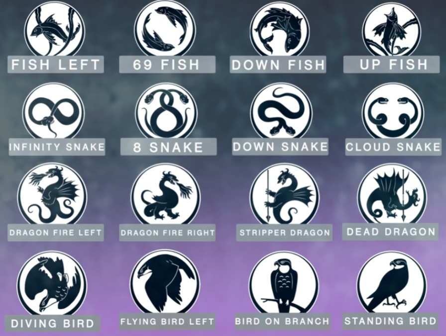

# 🏹 Last Wish — Raid Guide

---

## Quick Reference

| # | Encounter | Type |
|---|-----------|------|
| 1 | [Kalli, the Corrupted](#1-kalli-the-corrupted) | Plate puzzle + Boss |
| 2 | [Shuro Chi, the Corrupted](#2-shuro-chi-the-corrupted) | DPS + Puzzle rooms |
| 3 | [Morgeth, the Spirekeeper](#3-morgeth-the-spirekeeper) | Buff management + Boss |
| 4 | [The Vault](#4-the-vault) | Symbol puzzle |
| 5 | [Riven of a Thousand Voices](#5-riven-of-a-thousand-voices) | Final boss |
| 6 | [Riven's Heart](#6-rivens-heart) | Escort |

---

## Recommended Loadout

| Weapon | Why |
|--------|-----|
| **Whisper of the Worm** (Exotic Sniper) | Best sustained damage on every boss |
| **Sleeper Simulant** (Exotic LFR) | High burst damage alternative |
| **Ikelos Shotgun** | Top DPS in close-range damage phases |
| **Rocket Launcher** (e.g. Wardcliff Coil) | Vault and Heart escort add clear |
| **Well of Radiance** (Warlock) | Near-essential for every damage phase |
| **Nightstalker Tether** (Hunter) | Add control and orb generation throughout |
| **Sentinel / Sunbreaker** (Titan) | Roaming super for add clear |

> ⚠️ Equip **Minor Spec** mods on your primary — there are enormous numbers of red-bar enemies in every encounter.

> ⚠️ **Required expansion: Forsaken.**

---

## Symbol Reference

All encounters use the same 16 symbols. Agree on callouts before starting — a wrong call can wipe the team.



The names shown above are the most commonly used callouts. Your team can rename them but make sure everyone is aligned before you start.

---

## 1. Kalli, the Corrupted

**Goal:** Stand on all 6 plates matching the symbols in the centre arena to summon and kill Knights, then group up and DPS Kalli. Hide in the safe rooms when she charges her wipe attack. Repeat.

### How it Works

Six symbols hang above the central sunken arena. Each symbol corresponds to a plate around the room's perimeter — there are 9 total plates but only 6 will match. Pairs are assigned a symbol and must find and clear their plates.

> ⚠️ Extra plates exist around the room with symbols NOT in the centre. Activating a wrong plate spawns a powerful Ogre — essentially a wipe for underpowered teams.

### Steps

**Plate phase:**
1. Identify the 6 symbols hanging over the centre arena
2. Each pair locates their matching plates around the perimeter
3. Stand on the clear section of the plate — two sections will have Taken bombs that explode; the third strip is safe
4. Survive 3 bomb cycles on the clear strip → a Knight spawns → kill it → plate is complete
5. Repeat for all 6 plates → all symbols clear from the centre → Kalli enters damage phase

**Damage phase:**
1. Group up in the centre pit and DPS Kalli — aim for the head; use Well of Radiance
2. When the message "Kalli prepares to wield her weapon" appears, **immediately find a safe room**
3. Six doors open beneath Kalli — one per player; hide inside before the explosion
4. Exit the room, kill the Psion wave that spawns, resume DPS
5. This door/hide sequence repeats **3 times** per damage phase

After the third hide, if Kalli isn't dead, the symbols reset with new combinations — return to plates and repeat from the start.

> ⚠️ Each correctly cleared plate unlocks 3 safe rooms. Fail to clear a plate = 3 fewer safe rooms available during the damage phase.

### Player Roles

| Role | Players | Job |
|------|---------|-----|
| Pair 1 | P1, P2 | Find and clear their 2 symbol plates |
| Pair 2 | P3, P4 | Find and clear their 2 symbol plates |
| Pair 3 | P5, P6 | Find and clear their 2 symbol plates |

### Safe Room Assignment

Agree before the fight who goes where. A simple method: split into top 3 and bottom 3, then left/mid/right within each group. When Kalli moves, reassign on the fly.

### Tips

- Label the three sections of the room (e.g. Caves / Lights / Stage) for fast plate callouts
- Two players can clear a plate together — one on the safe strip, one killing enemies nearby
- Use a Nightstalker Tether on the Psion wave between door phases to quickly clear and restore Super energy

---

## 2. Shuro Chi, the Corrupted

**Goal:** Fight through 3 floors of a building. On each floor: clear adds, remove Shuro Chi's shield with Prism Weapons, DPS her, interrupt her wipe using Eye of Riven, then solve a 3-puzzle room to reset the timer. Repeat twice per floor.

### Key Mechanics

| Mechanic | What It Does |
|----------|-------------|
| **Shuro Chi's Song** | A 4-minute countdown — wipes the team if it reaches zero without the puzzle room being completed |
| **Prism Weapon** | Spawns on 3 plates near Shuro Chi; each holder shoots the player to their right to form a triangle and drop her shield |
| **Eye of Riven** | A Taken Captain that drops a Taken Essence weapon on death; its Super interrupts Shuro Chi's wipe attack |
| **Taken Essence debuff** | After using Eye of Riven, that player cannot pick up another for 90 seconds — a different player must take the next one |

### Steps — Per Floor (repeat twice before entering puzzle room)

1. Door opens — 4-minute timer starts. Clear all adds pushing toward Shuro Chi
2. Kill the Eye of Riven (special Taken Captain) → designated player picks up the Taken Essence
3. Prism Weapons spawn on 3 plates around Shuro Chi — one player per plate picks up a weapon and shoots the player to their **right** to form a triangle and drop her shield
4. DPS Shuro Chi until one health segment is removed — use Well of Radiance and Ikelos Shotgun
5. When she begins her wipe attack, the **Taken Essence holder uses their Super** on her to interrupt it
6. Finish the health segment if not done, then push forward to the next area and repeat for the second health segment

**Puzzle Room (after 2 health segments per floor):**
1. Enter the puzzle room — 4 players solve puzzles, 2 players kill enemies
2. Three pictures are on the walls; solve left to right
3. Each puzzle has missing sections — 9 buttons on the floor correspond to the grid positions
4. All 4 puzzle players stand on the buttons matching the missing sections **simultaneously**
5. > ⚠️ A player **cannot stand on the same button twice** across all three puzzles — plan ahead
6. Completing all 3 puzzles resets the 4-minute timer and activates platforms to the next floor

Repeat the full sequence on floors 2 and 3. The only differences:
- Floor 2 has Taken Psions instead of Thrall; Pervading Darkness added
- Floor 3 has Taken Acolytes; enemies keep spawning during the final damage phase — Well of Radiance is critical here

### Player Roles

| Role | Players | Job |
|------|---------|-----|
| Prism Weapon holders | P1, P2, P3 | Stand on plates; shoot the player to their right to break shield |
| Eye of Riven / interrupt | P4 (rotate) | Kills Eye of Riven; uses Super to interrupt Shuro Chi's wipe; rotates to new player after 90-sec debuff |
| Puzzle solvers | P1, P2, P3, P4 | All 4 solve the 3 wall puzzles; agree on button assignments before stepping |
| Add clear | P5, P6 | Kill enemies during puzzle room; help with adds during DPS phases |

### Tips

- The buttons damage you over time — solve each puzzle fast, don't stand around
- Read the puzzle like a book (left to right, top to bottom) and number the missing spots 1–4; assign each puzzle player a number
- If your team lacks DPS, use the Eye of Riven's Super to interrupt then immediately resume damage before she attempts again

---

## 3. Morgeth, the Spirekeeper

**Goal:** Collect all Taken Strength pillars spawning around the arena before Morgeth absorbs 100% of them. Cleanse teammates trapped by Umbral Enervation using Taken Essence. Once all strength is collected trigger the damage phase and DPS Morgeth's back.

### Key Mechanics

| Mechanic | What It Does |
|----------|-------------|
| **Taken Strength** | Pillars that spawn around the arena feeding Morgeth; at 100% absorbed = team wipe; max 2 per player — picking up a 3rd kills you instantly |
| **Umbral Enervation** | Morgeth randomly traps a player with Taken Strength x2 in place for 20 seconds; dies if not cleansed |
| **Taken Essence** | Dropped by Eye of Riven; use its grenade on a trapped player to free them — transfers their Taken Strength to you |

> ⚠️ The player cleansing Umbral Enervation **receives the trapped player's Taken Strength**. Never cleanse if you already have Taken Strength x1 — you'll absorb x2 and die instantly.

### Steps

1. Walk to the front of the arena and pick up the first Taken Strength to start the encounter
2. Split into two groups of 3 — left side and right side
3. Each group kills Eyes of Riven and collects Taken Strength as pillars spawn — **max 2 per player**
4. One designated player on each side stays at **zero Taken Strength** at all times — they are the Umbral Enervation cleanser
5. When a teammate is trapped, the cleanser kills an Eye of Riven, picks up Taken Essence, and uses the grenade on the trapped player — the cleanser is now holding that player's strength and the freed player becomes the new cleanser
6. Repeat until all Taken Strength is collected — the **final Taken Strength spawns directly in front of Morgeth** (same spot you started)
7. The player with the least Taken Strength picks up the last one → damage phase begins

**Damage phase:**
1. Group up as far from Morgeth as possible and DPS his **back** (the crit spot)
2. One player picks up a Taken Essence and watches Morgeth's strength counter
3. When strength reaches **90%**, that player uses the Taken Essence Super on Morgeth to reset his counter
4. One player shoots down the homing orbs Morgeth fires at the team throughout the phase

### Player Roles

| Role | Players | Job |
|------|---------|-----|
| Left side Taken Strength | P1, P2 | Collect Taken Strength; maintain max x2 |
| Left side cleanser | P3 | Stays at zero Taken Strength; cleanses Umbral Enervation on left side |
| Right side Taken Strength | P4, P5 | Mirror of left side |
| Right side cleanser | P6 | Mirror of left side cleanser |

### Tips

- After the Taken Essence is used on a trapped player the cleanser gets a 90-second lockout — the freed player must take over as cleanser immediately
- Taken Essence stays on the ground for 45 seconds after dropping — don't rush to pick it up unless someone is about to die in Umbral Enervation
- Two Eyes of Riven can spawn on the same side — the cleanser on that side should alert the other side in case they need to rotate

---

## 4. The Vault

**Goal:** Stand on 3 plates to read symbols, identify which plates have left or right duplicate symbols, kill Eyes of Riven for Taken Essence, and use the correct Essence type to cleanse the matching plate. Do this 3 times before the 3-minute timer expires. Stop Might of Riven Knights from reaching the plates.

### Key Rule

| Duplicate position | Required Essence |
|-------------------|-----------------|
| Symbol appears on the **left** of your plate | **Penumbra** |
| Symbol appears on the **right** of your plate | **Antumbra** |

> Memory trick: **P**enumbra = **P**late left (both start with a common association — or just remember "left = Penumbra, right = Antumbra")

### Arena Rooms

Label the three side rooms however works for your team. Common names:

| Room | Landmark |
|------|---------|
| Tree | Room with trees/plants |
| Disco | Room with the large mirrored ball |
| Rock | Room with the large rock in the centre |

### Steps

1. Three players stand on the 3 centre plates simultaneously — symbols appear in sets of 3 on each plate (left, centre, right)
2. Each plate holder calls out their **centre symbol**
3. Identify which plate has your centre symbol as a **left or right** symbol on another player's plate — call "Tree left" or "Disco right" etc.
4. The remaining 3 players kill adds and watch for **Might of Riven Knights** — these must be killed before they reach and lock a plate (if they do, it's a wipe)
5. Two of the three rooms seal off — the open room spawns an Eye of Riven; kill it and pick up the Taken Essence
6. The Essence holder runs through the connecting tunnels to the correct plate and uses the **grenade ability** to cleanse it

> ⚠️ Using the wrong Essence type (Penumbra on a right duplicate or vice versa) causes an explosion — kills the holder and nearby players.

7. Repeat for the 2nd and 3rd plates — Might of Riven count increases each round (1 → 2 → 3)
8. When all 3 plates are cleansed, a beam of light connects to the vault door — the whole process repeats
9. Complete **3 full rounds** (3 beams of light) to open the vault

### Player Roles

| Role | Players | Job |
|------|---------|-----|
| Plate holders | P1, P2, P3 | Stand on plates; call centre symbols and duplicate positions |
| Orb runner | P4 | Picks up Taken Essence; runs to correct plate and cleanses |
| Add clear / Knight killers | P5, P6 | Kill enemies; priority on Might of Riven Knights approaching plates |

### Tips

- You only need to call out 2 of the 3 plates — the 3rd can be figured out by process of elimination from the orb type
- Tractor Cannon can stun and push back Might of Riven Knights if your team is struggling to burst them down
- The Essence holder should call out "Penumbra" or "Antumbra" as soon as they pick it up so plate holders know which plate to send them to

---

## 5. Riven of a Thousand Voices

**Goal:** Split into two rooms to cleanse symbols and shoot Riven's eyes. Regroup upstairs, stagger Riven 3 times to identify 6 eyes, then shoot all 6 during a damage phase. Destroy weak points while descending. Repeat until final stand.

### Arena Overview

The fight starts with all 6 players on plates that send them down to a lower level. Split into two teams of 3 before descending — one goes to the **blue room**, one to the **yellow room**.

### Key Mechanics

| Mechanic | What It Does |
|----------|-------------|
| **Tentacle slam** | Stand near a tentacle briefly to bait it down, then shoot it to stagger Riven and reveal 2 glowing eyes |
| **Taken Fire** | Riven breathes fire — shoot inside her glowing mouth to stagger her and reveal 2 eyes |
| **Eye of Riven** | Spawns in the room without Riven; pick up Taken Essence and cleanse the correct symbol |
| **Glowing eyes** | Revealed after staggering Riven; the team in the other room must destroy these specific eyes |

### Steps — Two Room Phase (repeat twice)

**Room with Riven:**
1. Kill enemies; wait for Riven to appear
2. Either bait her tentacle (stand under it briefly then shoot it) or shoot inside her glowing mouth when she breathes fire — this staggers her
3. Two eyes will glow — call them out to the other team by name/number (e.g. "Top left, bottom right")
4. Kill the Eye of Riven that then spawns in your room — pick up Taken Essence and cleanse the correct symbol (see below)

**Room without Riven:**
1. Kill enemies; kill the Eye of Riven; pick up Taken Essence
2. Taken Essence holder looks at the bottom of the stairs — a symbol appears on the wall; call it out to your teammate
3. That teammate stands behind the glass/viewpoint and directs the Essence holder to where that symbol is on the floor
4. Essence holder uses the grenade ability on the correct floor symbol to cleanse it
5. Riven then enters your room — short damage phase begins; shoot the Taken orb in her mouth until it closes, then immediately shoot the **2 eyes called out by the other team**

After both rooms complete their sequence, take the lift at the back up to the next level and repeat. After two full levels, take the **centre lift** up to the main floor.

### Steps — Top Level (all 6 players)

1. Clear enemies (Taken Goblins and Ogres spawn each time Riven appears)
2. Riven appears through one of the black gates — stagger her (tentacle or mouth) and two eyes glow
3. **Assign each player one eye as it appears** — they remember it for the damage phase
4. Repeat 3 times — **6 eyes total memorised**
5. Riven appears a 4th time with the Taken orb visible in her mouth — group up and DPS it
6. When her mouth closes, each player destroys **the one eye they were assigned** — all 6 must be destroyed or it's a wipe
7. Riven retreats → return to plates and stand on them

**Weak Point Descent:**
- All 6 on plates → lifts lower you back down past Riven crawling around the crystal
- Shoot the glowing weak points on her body as you descend — each one removed deals a large chunk of damage
- Repeat the full sequence until the final portion of Riven's health is reached → teleported to Ascendant plane

**Ascendant Plane:**
- Navigate up the floating debris to Riven's face at the top of the level
- One player touches the beam of light at the top → entire team teleports back
- > ⚠️ A debuff called **Ascendant Atrophy** slowly removes health — move fast, kill Taken Phalanx in the way

**Final Stand:**
- Riven opens her mouth — DPS the Taken orb until she's out of health
- Run into her mouth and destroy the **Taken Blight inside** (Metaphysical Bleed debuff ticks — don't stop moving)

### Eye Callout System

Number the eyes 1–6 or use positional names (L1–L3, R1–R3 from left to right). Agree before starting — the top floor phase gives you no time to debate.

### Player Roles

| Role | Players | Job |
|------|---------|-----|
| Blue room team | P1, P2, P3 | Cleanse symbols / shoot eyes alternating with yellow room |
| Yellow room team | P4, P5, P6 | Mirror of blue room |
| Taken Essence runner | Rotates | Picks up and cleanses the correct symbol on the floor |
| Eye caller | All | Each player memorises and destroys their own assigned eye on the top floor |

### Tips

- Assign one eye per player on the top floor — six players, six eyes, one each; much less confusing than trying to remember multiple
- When staggering Riven on the top floor, two players immediately claim the 2 eyes that just appeared so everyone knows who owns what before the damage phase
- Well of Radiance + Tether is the strongest combination here — Tether weakens Riven and generates orbs, Well keeps the team alive during the descent

---

## 6. Riven's Heart

**Goal:** Carry Riven's heart back through the raid to the statue of Riven. One player holds the heart while the others stay in its aura to avoid dying to Creeping Darkness. When the carrier is teleported to another realm, the inside team collects beams of light to reset the timer.

### Key Mechanics

| Mechanic | What It Does |
|----------|-------------|
| **Creeping Darkness** | Stacks to x10 on all players not in the heart carrier's aura — kills at x10 |
| **Heart timer** | The carrier's aura shrinks over ~15 seconds; when it expires they are teleported into the other realm and the next player picks up the heart |
| **Beams of light** | Appear in the realm — all realm players collect them simultaneously to reset the current carrier's timer once |
| **Mights of Riven** | Powerful Taken Knights that spawn inside the realm; kill them to stay alive |

### Steps

1. One player picks up Riven's heart from the chest cavity and begins moving out of her mouth
2. All other players stay **inside the aura** to avoid Creeping Darkness stacking
3. The carrier counts down their timer aloud — when near zero, players clear ahead and stand back
4. Carrier is teleported into the realm → next player picks up the heart and continues moving
5. Players inside the realm collect **all beams of light simultaneously** to give the new carrier one timer reset
6. After the timer resets once and expires again, another player is teleported inside — repeat
7. Navigate back through the raid: exit Riven's mouth → left through the crumbled room → through the Vault tunnels → down to the basin below the statue of Riven
8. Approach the statue — the heart automatically dunks and the encounter ends

> ⚠️ **Stay away from the heart carrier** just before they are teleported — standing too close pulls you into the realm with them. If 2 players are accidentally pulled in, wipe and restart from the checkpoint.

### Route Back

```
Riven's mouth → left through crumbled room (avoid poisoned floor using debris)
→ enter Vault side room → use connecting tunnels to circle the vault
→ drop through the hole → up the stairs lit with flares → dunk at the statue basin
```

### Player Roles

| Role | Players | Job |
|------|---------|-----|
| Heart carrier | Rotates | Carries heart; counts down timer; moves as fast as possible |
| Escort | Remaining | Stay in carrier's aura; clear enemies ahead; do not outrun the carrier |
| Realm players | Teleported players | Kill Mights of Riven; collect beams of light together to reset the carrier's timer |

### Tips

- The heart carrier can only **walk and single-jump** — clear the path ahead, especially through the crumbled room debris section
- Use mobile Supers (Blade Barrage, Nova Bomb) while escorting — there are constant enemy spawns along the route
- Switch to Rocket Launchers and Grenade Launchers for fast add clear during the escort

---

## Loot Table

| Encounter | Weapons | Armor |
|-----------|---------|-------|
| Kalli | Age-Old Bond (Auto), Chattering Bone (Pulse), Nation of Beasts (HC) | Arms, Class Item |
| Shuro Chi | Age-Old Bond (Auto), Transfiguration (Scout), Nation of Beasts (HC) | Chest, Legs |
| Morgeth | Age-Old Bond (Auto), Chattering Bone (Pulse), Apex Predator (RL) | Head, Arms |
| Vault | Transfiguration (Scout), Apex Predator (RL), Techeun Force (Fusion) | Head, Chest |
| Riven | Apex Predator (RL), Techeun Force (Fusion), **One Thousand Voices ⭐** | Head, Chest, Legs |

> ⭐ **One Thousand Voices** (Exotic Fusion Rifle) is a random drop from the Riven chest — not guaranteed.

---
