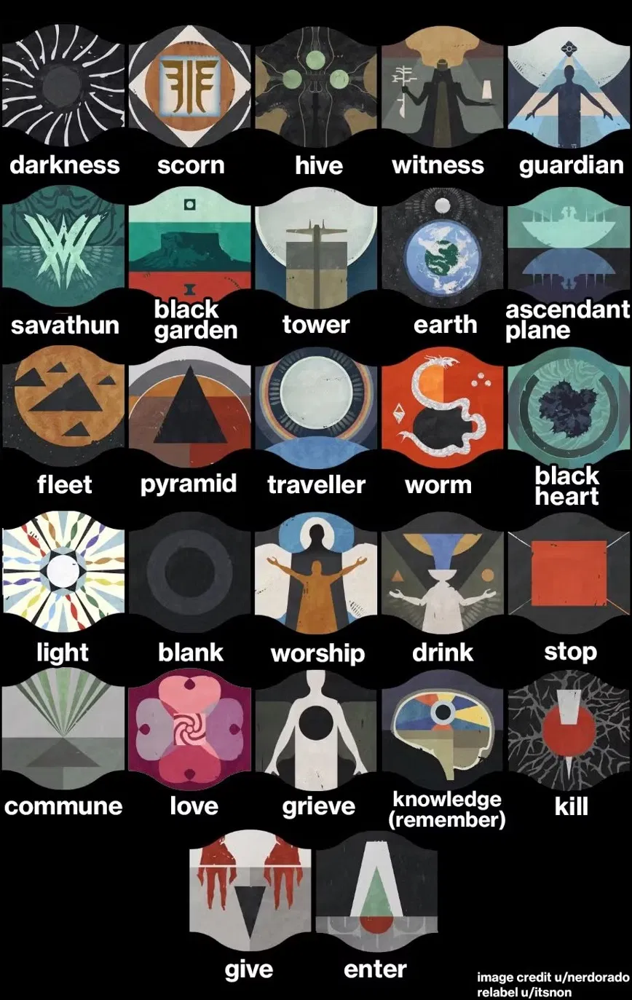
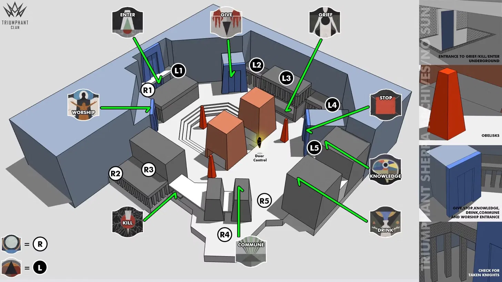

# 🏛️ Vow of the Disciple — Raid Guide

---

## 📋 Quick Reference

| # | Encounter | Type |
|---|-----------|------|
| 1 | [Opening — The Disciple's Bog](#1-opening--the-disciples-bog) | Payload escort |
| 2 | [Acquisition](#2-acquisition) | Symbol puzzle |
| 3 | [The Caretaker](#3-the-caretaker) | Boss fight |
| 4 | [Exhibition](#4-exhibition) | Relay puzzle |
| 5 | [Rhulk, Disciple of the Witness](#5-rhulk-disciple-of-the-witness) | Final boss |

---

## 🗡️ Recommended Loadout (All Encounters)

| Weapon | Why |
|--------|-----|
| **Divinity** (Exotic Trace Rifle) | Creates a large crit bubble on Rhulk — near-essential for damage phases |
| **Linear Fusion Rifle** | Best sustained DPS on Rhulk (e.g. Taipan, Cataclysmic) |
| **Machine Gun** | Excellent add clear and stun setup on Caretaker (e.g. Commemoration) |
| **Gjallarhorn / Rocket Launcher** | High burst damage on Caretaker last stand and Rhulk |
| **Sniper Rifle** | Long-range DPS option; good ammo efficiency |
| **Outbreak Perfected** (Exotic Pulse) | Solid Caretaker DPS if out of Heavy ammo |
| **Well of Radiance** (Warlock) | Near-essential for survivability in all damage phases |
| **Ward of Dawn** (Titan) | Weapons of Light buff for big damage phases |
| **Tether** (Hunter) | Powerful super DPS during Rhulk damage phase |

> ⚠️ **Must have completed the Witch Queen Campaign to access this raid.**

---

## 🔣 Symbol Reference

There are **27 symbols** used in every encounter. All six players must agree on callouts before starting. The image below shows all symbols and their names — refer to it whenever learning new encounters.

---

## 1. Opening — The Disciple's Bog

**Goal:** Escort the payload barge through six areas by collecting knowledge founts and dunking them on it.

### How it Works

Spawn in, kill the reflection of Savathun, and hop on your Sparrow. Roll up to the large dark barge — this is your payload. Enemies and **Knowledge Bearers** (yellow-bar Abominations) spawn in each area. Straying too far from the barge gives you **Pervading Darkness**, which stacks up to 10 and kills you.

Killing all Knowledge Bearers in the area stops Darkness from stacking and spawns glowing orange **Knowledge Founts** on the ground.

### Steps

1. Kill all Knowledge Bearers as fast as possible to pause Pervading Darkness stacking
2. Pick up the glowing orange founts — max **3 per person**
3. Return to the barge and dunk the founts on it to advance it and clear Darkness stacks
4. Follow the barge to the next area and repeat
5. Do this across **6 areas** — the barge parks itself inside the Pyramid at the end

### Fount Buff Stacks

| Founts Held | Buff Name |
|-------------|-----------|
| 1 | Heightened Knowledge |
| 2 | Brimming Knowledge |
| 3 | Overflowing Knowledge |

### Player Roles

| Role | Players | Job |
|------|---------|-----|
| Knowledge Bearer killers | P1, P2, P3, P4 | Focus on killing yellow-bar Abominations the moment they spawn |
| Fount runners | P5, P6 | Grab 3 founts each and dunk on the barge; swap with killers as needed |

> 🔄 This is a low-pressure warm-up encounter — rotate freely and stay near the barge.

### Tips

- The barge moves **fast** — don't fall behind or you'll get stranded with Darkness stacks
- Darkness stacks are cleared when you dunk founts, so prioritize killing Bearers over collecting founts prematurely
- Secret chest: during the escort, shoot **3 hidden Cruxes** scattered in the environment. A chest appears in the building to the right just before the Pyramid — face the Pyramid and look behind you to the right. Approach a Crux to see an indicator appear

---

## 2. Acquisition

**Goal:** Identify the correct symbol at each Obelisk by killing Glyph Keepers, then shoot the three matching symbols on the correct Obelisk before it fills.

### How it Works

The large museum room has three **Obelisks** (south, east, west) — each slowly fills with energy. If any Obelisk fills completely, the team wipes. Split into three pairs, one per Obelisk.

Around the room are **nine Temples**, each labelled with a symbol (see map below). Each Obelisk has a matching **Pillar** that displays clues.

### Steps — Per Obelisk Pair

1. Shoot the **Crux** in the north of the room to start the encounter (also toggles temple doors open/closed during the fight)
2. The top symbol on a Pillar shows **Traveler** or **Pyramid** — this tells you which side of the room the **Compass Knight** is hiding on (Traveler = east, Pyramid = west). Kill it
3. Killing the Compass Knight reveals the **middle symbol** on the Pillar — this matches a Temple door. The runner goes to that Temple
4. Inside the Temple are two Glyph Keepers: one on the **Light side** (left wall), one on the **Darkness side** (right wall). Kill both
5. The **bottom symbol** on the Pillar shows Light or Darkness — the defender calls this to the runner
6. The runner memorises the symbol that dropped above the correct Glyph Keeper's head and returns to the Obelisk
7. All three pairs share their symbols — find the **one Obelisk that has all three symbols** on it
8. All players converge on that Obelisk and shoot all three symbols simultaneously (they must be shot almost at the same time — more shooters = easier)
9. Chat log shows **"The obelisk accepts your offering"** if correct
10. Repeat for all three Obelisk phases

### Player Roles

| Role | Players | Job |
|------|---------|-----|
| South pair | P1 (defender), P2 (runner) | P1 reads Pillar, guards Obelisk, kills Knights; P2 enters Temples, reads symbols |
| East pair | P3 (defender), P4 (runner) | Same as above |
| West pair | P5 (defender), P6 (runner) | Same as above |

> 🔄 Defenders need an **Unstoppable weapon** — Compass Knights are Unstoppable Champions.

### Tips

- Shooting the **wrong symbol** on an Obelisk gives "The obelisk rejects your offering" — you get a few wrong attempts before it fills and wipes
- If a symbol registers as correct but doesn't trigger the acceptance message, **keep shooting it** until it does
- Killing Glyph Keepers drains Obelisk energy — kill them regularly to keep energy low
- You can only read a Pillar up close — it appears blank from across the room
- Runners should carry a **Power weapon** (e.g. Gjallarhorn) to burst down Glyph Keepers quickly

---

## 3. The Caretaker

**Goal:** Stun and push back a giant Scorn boss on each of four floors while runners collect symbols from a dark room and deposit them into the Obelisk. Damage the boss in DPS windows. Repeat across four floors.

### How it Works

The room has a dark inner room (symbols), an Obelisk (deposit target), and three plates (DPS). If the Caretaker reaches the Obelisk — or time runs out — the team wipes. Split into three teams: **Runners**, **Stunners**, and **Add Clear**.

### Steps

**Symbol Phase:**
1. One runner shoots the Crux to open the dark room and start the encounter
2. Runner enters the dark room and collects up to **3 symbol buffs** (Pervading Darkness stacks inside — move fast, avoid Wizards)
3. A teammate outside opens the door when the runner is ready to exit
4. Runner returns to the Obelisk — shoot the three symbols that match your buffs when prompted
5. Swap runners so Darkness doesn't stack too high
6. **9 total symbols deposited** → DPS phase begins

**Stun Loop (Stunners run this simultaneously):**
1. P1 runs under the Caretaker's legs to make him mad — he stomps
2. His **face glows** when mad — P2 shoots it with a Machine Gun to stagger him
3. His **back opens** after stagger — P2 shoots it to knock him down briefly
4. Repeat; if one stunner has the debuff, the other takes over

**DPS Phase:**
1. Caretaker walks toward the plates — stand on the **first plate** (closest to his path) when it glows yellow
2. Damage him until the plate fades, then move to the **middle plate**, then the **third plate**
3. After three plates (or his health gate) he ascends to the next floor — follow via the stairs that drop down
4. Repeat the full cycle on floors 2, 3, and 4

**Last Stand (Floor 4):**
Three plates in a line down a hallway. Stand on the first, damage, move forward. Kill him before the final plate fades or it's a wipe.

### Player Roles

| Role | Players | Job |
|------|---------|-----|
| Runners | P1, P2 | Alternate entering the dark room; collect 3 symbols each; deposit at Obelisk |
| Stunners | P3, P4 | Keep the Caretaker stunned and away from the Obelisk; alternate when debuffed |
| Add Clear | P5, P6 | Kill all ads; assist stunners when Caretaker glows; assist runners with door |

> ⚠️ The **dark room has pitfalls and Wizards** — don't rush. Runners can grab 1 or 2 symbols if time is tight rather than risking death for 3.

### Tips

- The Caretaker launches **spiralling football projectiles** during the last stand — shoot them out of the air
- P5/P6 on add clear should read the stunner and runner roles in case they need to fill in
- Use a **Special ammo finisher** build to regenerate shotgun/sniper ammo for DPS phases
- Recommended DPS: 2× Divinity + Linear Fusion Rifles or Snipers; Outbreak Perfected as a swap if heavy runs dry

---

## 4. Exhibition

**Goal:** Fight through four rooms using three relics to kill Knights, cleanse allies, and destroy Taken orbs — before the **Terminal Resonance** timer expires. Identify matching symbols to open each room's door.

### The Three Relics

| Relic | Use |
|-------|-----|
| **Darkness Splinter** (Pyramid laser) | Shoot shielded Taken Knights to remove their shield and kill them |
| **Aegis** (Templar shield from VoG) | Grenade button cleanses allies of Pervading Darkness |
| **Eye of Riven** (Taken eye) | Grenade button destroys Taken immunity orbs |

> ⚠️ Dropping a relic gives a **30-second debuff** preventing you from picking up another. Assign relic holders per room and swap at the break room depositories between rooms.

### How It Works

Each room has:
- **Taken and Scorn Glyph Keepers** that drop symbols when killed
- A **shielded Taken Knight** (killed by Darkness Splinter)
- A **door** that opens when you shoot the correct matching symbol on the wall

**Relic holders can only see Taken Glyph Keeper symbols. Non-relic holders can only see Scorn Glyph Keeper symbols.** Find the one symbol in common between both groups — that's what you shoot on the door.

Starting from room 2, you need **two matching symbols** to open each door (two pairs of Glyph Keepers).

### Room Breakdown

| Room | Relics Active | New Mechanic |
|------|--------------|--------------|
| 1 | Darkness Splinter only | Learn the basic loop |
| 2 | Splinter + Aegis | Pervading Darkness debuff added; Overload Champions spawn |
| 3 | Splinter + Aegis + Eye of Riven | Taken immunity orbs added |
| 4 | All three | Platforming section with pits — do not rush |

### Player Roles

| Role | Players | Job |
|------|---------|-----|
| Darkness Splinter holder | P1 (room 1–2), P4 (room 3–4) | Kill shielded Knights after Glyph Keepers die; call Taken Glyph Keeper symbols |
| Aegis holder | P2 (room 2–3), P5 (room 4) | Cleanse team of Pervading Darkness regularly |
| Eye of Riven holder | P3 (room 3), P6 (room 4) | Destroy Taken immunity orbs; call Taken symbols |
| Non-relic players | Remaining | Kill ads; call Scorn Glyph Keeper symbols; shoot the door symbol |

> 🔄 Swap relic assignments each room at the break room depositories — whoever doesn't have a debuff picks up the next relic.

### Tips

- **Screeb spawn in doorways** between rooms — don't rush in or you'll explode
- Relic holders should hang back slightly — they deal less damage and need to stay alive
- If a relic falls into a pit in room 4, it respawns in the previous break room
- Timer resets to **1:15** when you deposit relics at the door; killing Knights also adds time

---

## 5. Rhulk, Disciple of the Witness

**Goal:** Survive two phases — a Symbol/Glyph phase to push back Rhulk's shield and unlock damage, then a Damage phase where you break four weakpoints and deal DPS. Repeat until dead.

### Key Buffs

| Buff | How to Get | What It Does |
|------|-----------|--------------|
| **Leeching Force** | Shoot and destroy a darkness crystal | Allows absorbing Rhulk's laser beam |
| **Emanating Force** | Walk into Rhulk's laser while holding Leeching Force | Allows entering Rhulk's barrier; deposit in pillars to push back his shield |

> ⚠️ **Both buffs have timers — if they expire while held, you die.** Move fast.

> ⚠️ The third immunity crystal Rhulk spawns (if you haven't reached DPS yet) is **immune and wipes the team.** You must complete 6 deposits before that happens.

---

### Phase 1 — Symbol Phase (Push Back the Shield)

**Goal:** Deposit Emanating Force into 6 pillars to fully push back Rhulk's orange barrier and reach the damage arena.

#### Leeching Force Multiplying

1. One player shoots the **first crystal** above Rhulk → gets Leeching Force
2. That player stands on the **Leeching Base** (the Gift symbol on the floor at the back of the room)
3. **Two different players** shoot the smaller crystals that spawn to Rhulk's left and right → the original player loses Leeching Force; those two players each gain it

You now have **2 Leeching Force** players. One converts to Emanating Force; the other repeats the split from the Leeching Base.

#### Deposit Loop

1. Two Leeching Force players stand on the Leeching Base → split into four (two go for Emanating)
2. Rhulk teleports and fires a **laser** — Leeching Force players intentionally take the beam to convert to Emanating Force
3. **Glyph Keepers spawn** — non-buff players kill them; symbols appear on both sides of the arena:
   - **Buff players** can see the **left-side symbols**
   - **Non-buff players** can see the **right-side symbols AND the six pillars**
4. Compare symbols between both groups — find the **one matching symbol**
5. Non-buff player calls which pillar(s) have that symbol
6. Emanating Force players deposit in a correct pillar → Rhulk's shield retreats

Repeat until **6 deposits** are made → Rhulk retreats to the upper damage platform.

#### Oracle Callouts — Pillar Labels

Label the six pillars by position:

### Player Roles — Phase 1

| Role | Players | Job |
|------|---------|-----|
| Leeching Force splitters | P1, P2 | Manage crystals and Leeching Base splits; one converts to Emanating each round |
| Emanating Force depositors | P3, P4 | Tank laser → deposit in called pillar; avoid dying to Rhulk's attacks |
| Symbol readers / add clear | P5, P6 | Kill Glyph Keepers; call right-side symbols; call matching pillar location |

> 🔄 Roles rotate naturally — whoever converts Leeching to Emanating is whoever needs to tank the laser next.

---

### Phase 2 — Damage Phase (Break Weakpoints + DPS)

After 6 deposits, follow Rhulk up the stairs to the damage arena.

#### Weakpoint Loop (repeat 4 times)

1. One player keeps Rhulk's attention by shooting him — he'll chase that player
2. Rhulk dashes and **drops his glaive** → one player shoots and destroys it → gets Leeching Force
3. The broken glaive leaves a **symbol behind** — only non-buff players can see it. They call it out
4. There are only **4 symbols** in this phase, each matching a corner pillar:

| Symbol | Corner |
|--------|--------|
| Darkness | Back-left |
| Pyramid | Back-right |
| Light | Front-left |
| Traveler | Front-right |

5. Leeching Force player tanks Rhulk's laser → gets Emanating Force
6. Deposits Emanating Force in the **called corner pillar** → exposes a **weakpoint** on Rhulk
7. All players shoot the weakpoint to break it

After **4 weakpoints** are broken → Rhulk becomes vulnerable. DPS him aggressively.

#### DPS Tips

- **Divinity** user creates a large crit bubble — everyone aims inside it
- Use Linear Fusion Rifles or Snipers on the bubble for maximum damage
- Fire one-and-done Supers (Thundercrash, Nova Bomb, Tether) during this window
- Rhulk will eventually kneel and go immune — run back down the stairs to the Leeching Base and restart Phase 1

#### Rhulk's Attacks (Damage Arena)

| Attack | Description | Counter |
|--------|-------------|---------|
| Glaive dash | Fast forward lunge — deletes anything in path | Watch the tell; dodge sideways |
| Four-directional laser | Fires beams outward in 4 directions | Move to a gap between beams |
| Kick | Melee if you're too close | Stay at mid-range |
| Shield build-up | Kneels and regenerates — end of window | Run back to Leeching Base immediately |

### Player Roles — Phase 2

| Role | Players | Job |
|------|---------|-----|
| Aggro holder | P1 | Keeps Rhulk's attention and moving; calls when glaive drops |
| Glaive breaker / Leeching Force | P2 (rotate) | Shoots glaive; tanks laser; deposits in called pillar |
| Symbol callers | P3, P4 | Call glaive symbol; call matching corner pillar |
| DPS | P5, P6 | Shoot weakpoints; max damage during vulnerable window; one on Divinity |

---

### Final Stand

When Rhulk reaches roughly **20% health**, he enters final stand — he continuously chases and attacks while **Pervading Darkness** stacks on the entire team. Kill him before 10 stacks or it's a wipe. Burn everything you have.

---

## 🎁 Loot Table

| Encounter | Weapons | Armor |
|-----------|---------|-------|
| Acquisition | Submission (SMG), Forbearance (GL), Cataclysmic (LFR) | Legs, Arms |
| The Caretaker | Submission (SMG), Delicate Tomb (Fusion), Forbearance (GL) | Chest, Class Item |
| Exhibition | Submission (SMG), Delicate Tomb (Fusion), Cataclysmic (LFR) | Head, Arms |
| Rhulk | Cataclysmic (LFR), Forbearance (GL), **Lubrae's Ruin ⭐** | Head, Chest, Legs |

> ⭐ **Lubrae's Ruin** (Exotic Glaive) is a random drop from Rhulk — not guaranteed on first clear.

---
